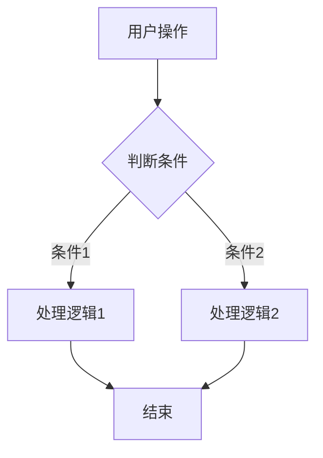

# code-view-fe 前端代码解读技能

## 输入

接受两种输入方式（任意一种即可）：
1. **文件路径**：直接提供代码文件的路径
2. **代码内容**：直接粘贴代码内容

## 输出

生成一个与源文件同名的 `.md` 文档，保存到源文件同一目录下。

**例如：** `addform.vue` → `addform.vue.md`

## 文档结构

生成的文档必须包含以下五个部分：

### 1. 文件定位

```
文件：[文件名]
路径：[相对路径]
模块：[工具类 / 接口模块 / 业务逻辑 / 配置 / 组件]
```

**判断规则：**
- `src/api/` 或 `src/services/` → 接口模块
- `src/utils/` 或 `src/helpers/` → 工具类
- `src/views/` 或 `src/page/` → 业务逻辑/页面
- `src/components/` → 组件
- `src/config/` 或 `src/settings/` → 配置
- `.ts`/`.tsx` 文件配合 `useState/useEffect/useCallback` 或 `React.*` → React
- `.vue` 文件配合 `export default {}` 或 `data()/methods/` → Vue (Options API)
- `.vue` 文件配合 `setup()` 或 `<script setup>` → Vue (Composition API)

### 2. 核心功能

用一句话总结文件的主要职责。

**格式：**
```
核心功能：[一句话描述]
示例：这个文件是培训通知单管理组件，核心功能是新增/编辑/查看培训通知单及其人员信息。
```

### 3. 流程图

使用 Mermaid 语法绘制组件的整体架构流程图。

**格式：**
````

````

**要求：**
- 用 Mermaid `graph TD` 语法
- 从用户视角出发，描述组件的整体处理流程
- 包含条件分支
- 关键处理节点用方框
- 条件判断用菱形

### 4. 事件流向图（触发链）

前端逻辑 90% 都是事件驱动，用触发链表示比复杂流程图更清晰。

**格式：**
```
用户操作 → 触发事件 → 代码处理 → 结果
```

**示例：**
```
用户点击"确定"按钮
  → 触发 submit()
  → 调用 validate() 校验表单
  → 校验通过
    → 调用 add() 或 update() API
    → 调用 addBatch1() 批量添加人员
    → 成功后调用 $emit('callBack') 通知父组件
    → 调用 closed() 关闭弹窗
  → 校验失败 → 提示错误信息
```

**注意：**
- 始终从用户视角开始
- 按代码执行顺序列出
- 每个节点一行，用 `→` 连接
- 包含条件分支（校验通过/失败 等）

### 5. 数据流概览

描述组件的数据来源和去处。

**格式：**
```
数据来源：
  - props：接收父组件传入的 [参数名]
  - API：从 [接口模块] 调用 [方法名] 获取数据
  - 用户输入：从表单收集

数据发出：
  - API：调用 [方法名] 提交数据
  - emit：向父组件发送 [事件名] 事件
  - 本地状态：更新 [状态名]
```

### 6. 执行步骤清单

按代码执行顺序，详细列出每个步骤。

**格式：**
```
## 执行步骤

**第一步：[标题]**
- 代码位置：methods/mounted/computed
- 做什么：[详细描述]
- 关键代码逻辑：
  ```[对应语言]
  // 关键代码片段
  ```

**第二步：[标题]**
...
```

---

## 输出要求

- **文件编码**：使用 UTF-8
- **文件命名**：`[原文件名].md`
- **保存位置**：与源文件同一目录
- **语言**：所有说明使用中文

## Vue 3 Composition API 特殊处理

当分析 Vue 3 Composition API 代码时，额外关注：

1. **ref/reactive 响应式变量**：列出所有响应式状态及其用途
2. **computed 计算属性**：列出计算属性及其依赖
3. **watch 监听器**：列出监听目标及其副作用
4. **hook 复用**：识别可复用的逻辑片段

## React 特殊处理

当分析 React 代码时，额外关注：

1. **useState/useReducer**：列出所有状态及其用途
2. **useEffect**：列出副作用及其触发条件
3. **useCallback/useMemo**：识别性能优化点
4. **组件层级**：识别 presentational vs container 组件

## 注意事项

- 只分析当前文件，不主动分析依赖文件
- 如果代码过长（>2000行），可以聚焦于核心逻辑，跳过次要部分
- 保持简洁，避免不必要的废话
